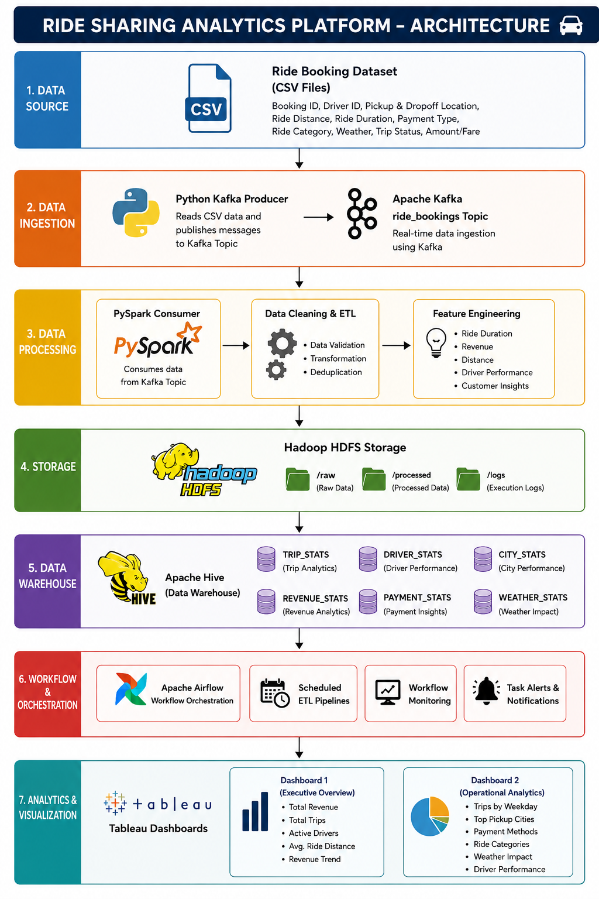
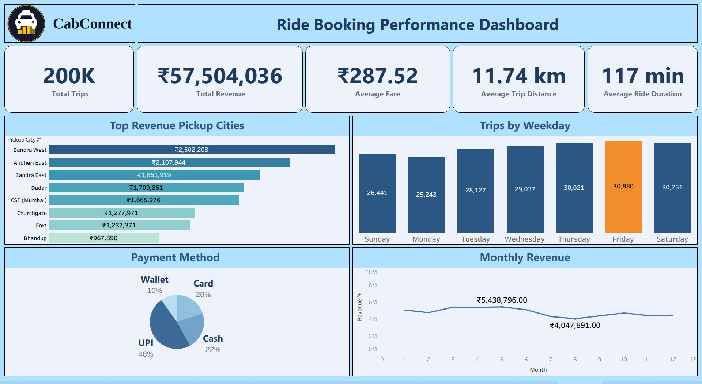
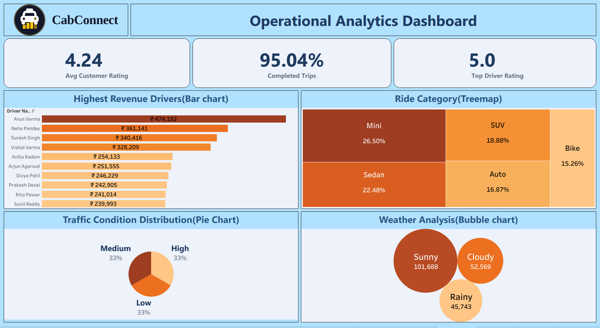

# 🚖 Ride Sharing Analytics Platform
### Big Data Analytics for Ride Booking Insights

A scalable **Big Data Analytics Platform** that processes large-scale ride booking data using **Apache Kafka, PySpark, Hadoop HDFS, Hive, Apache Airflow, and Tableau**. The project transforms raw ride booking data into meaningful business insights through an automated ETL pipeline and interactive dashboards.

Ride-sharing companies generate thousands of ride bookings daily. Processing this large volume of data using traditional databases becomes inefficient.

This project builds a scalable analytics platform capable of ingesting, processing, storing, and analyzing ride-booking data to support operational monitoring and business decision-making.

---

##  Project Overview

The Ride Sharing Analytics Platform is a Big Data project developed to process, transform, and analyze large-scale ride booking data. The platform builds an end-to-end analytics pipeline that converts raw ride data into business insights through distributed processing, data warehousingand interactive dashboards.

This project builds a complete Big Data pipeline that:

- Cleans and processes ride booking data
- Stores data in Hadoop HDFS
- Performs distributed processing using PySpark
- Loads processed data into Apache Hive
- Automates ETL using Apache Airflow
- Visualizes KPIs using Tableau dashboards

---

## Objectives

- Build a scalable Big Data pipeline
- Process large ride booking datasets efficiently
- Store structured data in Apache Hive
- Automate ETL workflows using Airflow
- Generate analytical reports
- Build interactive Tableau dashboards
- Enable data-driven business decisions

---

#  Project Architecture



---

# Workflow

```text
Ride Booking Dataset
        │
        ▼
Data Cleaning (Python)
        │
        ▼
Kafka Streaming
        │
        ▼
PySpark Processing
        │
        ▼
HDFS Storage
        │
        ▼
Apache Hive
        │
        ▼
Tableau Dashboard
```

---

# 🛠️ Technology Stack

| Category | Technologies |
|----------|--------------|
| Programming | Python |
| Big Data | Apache Kafka |
| Storage | Hadoop HDFS |
| Data Warehouse | Apache Hive |
| Processing | Apache Spark (PySpark) |
| Visualization | Tableau Public |
| Version Control | Git & GitHub |

---

# 📂 Dataset

**Source:** Ride Booking Dataset (Mumbai)

### Dataset Size

- **200,000 Records**
- **25 Columns**

### Important Features

- Booking ID
- Pickup Date
- Pickup Time
- Pickup City
- Drop City
- Fare Amount
- Final Fare
- Trip Distance
- Ride Duration
- Passenger Count
- Driver Rating
- Customer Rating
- Payment Type
- Payment Status
- Traffic Condition
- Weather
- Trip Status

---

# ⚙️ ETL Workflow

#1.Ride booking CSV data is ingested.
#2.Kafka Producer streams booking records.
#3.Kafka stores ride events.
#4.PySpark Consumer processes streaming data.
#5.Data cleaning and transformation are performed.
#6.Processed data is stored in Hadoop HDFS.
#7.Hive stores processed data.
#8.HiveQL generates analytical datasets.
#9.Analytical CSV files are exported.
#10.Tableau dashboards visualize business insights.

# Dashboard Features
### Executive Dashboard

- Total Trips
- Total Revenue
- Average Fare
- Average Trip Distance
- Average Ride Duration
- Monthly Revenue Trend
- Trips by Weekday
- Top Revenue Pickup Cities
- Payment Method Distribution

### Operational Dashboard

- Driver Performance
- Customer Ratings
- Ride Category Analysis
- Weather Analysis
- Traffic Analysis
- Trip Status Distribution
- Highest Revenue Drivers

### KPIs

- Total Bookings
- Total Revenue
- Completed Trips
- Cancelled Trips
- Average Trip Distance
- Average Fare
- Average Ride Duration


## Dashboard Preview
# Ride Booking Performance Dashboard




---

# Operational Analytics Dashboard



---

# Business Insights

- Friday records the highest number of bookings.
- UPI is the most preferred payment method.
- Bandra West generates the highest revenue.
- Mini rides dominate total bookings.
- Highest driver rating reaches 5.0.
- Completed trip rate exceeds 95%.
- Sunny weather experiences maximum ride demand.

---

# Advantages

- Scalable architecture
- Distributed data processing
- Automated ETL workflow
- Interactive dashboards
- Faster analytics
- Centralized KPI monitoring
- Better business decision-making

---

# Future Enhancements

- Live Kafka to Tableau integration
- Real-time streaming dashboards
- Demand Forecasting
- Driver Recommendation System
- Route Optimization
- ML-Based Surge Pricing
- Cloud deployment using AWS/Azure

---


---


# Author
Vatsal RohitKumar Mistry
