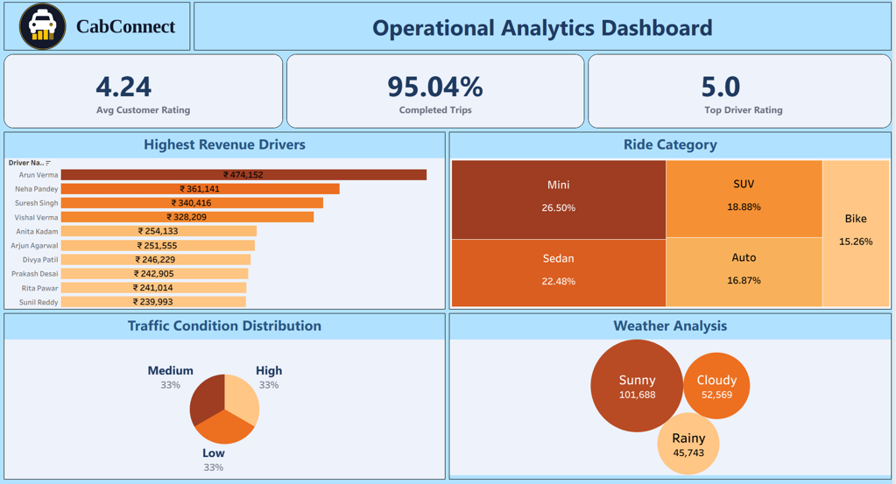

# 🚖 Ride Sharing Analytics Platform
### Big Data Analytics for Ride Booking Insights

A scalable **Big Data Analytics Platform** that processes large-scale ride booking data using **Apache Kafka, PySpark, Hadoop HDFS, Hive, Apache Airflow, and Tableau**. The project transforms raw ride booking data into meaningful business insights through an automated ETL pipeline and interactive dashboards.

---

##  Project Overview

Ride-sharing companies generate millions of booking records every day. Traditional analytics systems struggle to process large-scale datasets efficiently and provide real-time business insights.

This project builds a complete Big Data pipeline that:

- Cleans and processes ride booking data
- Stores data in Hadoop HDFS
- Performs distributed processing using PySpark
- Loads processed data into Apache Hive
- Automates ETL using Apache Airflow
- Visualizes KPIs using Tableau dashboards

---

## Objectives

- Build a scalable Big Data pipeline
- Process large ride booking datasets efficiently
- Store structured data in Apache Hive
- Automate ETL workflows using Airflow
- Generate analytical reports
- Build interactive Tableau dashboards
- Enable data-driven business decisions

---

#  Project Architecture


---

# Workflow

```text
Ride Booking Dataset
        │
        ▼
Data Cleaning (Python)
        │
        ▼
Kafka Streaming
        │
        ▼
PySpark Processing
        │
        ▼
HDFS Storage
        │
        ▼
Apache Hive
        │
        ▼
Tableau Dashboard
```

---

# 🛠️ Technology Stack

| Category | Technologies |
|----------|--------------|
| Programming | Python |
| Big Data | Apache Kafka |
| Storage | Hadoop HDFS |
| Data Warehouse | Apache Hive |
| Processing | Apache Spark (PySpark) |
| Visualization | Tableau Public |
| Version Control | Git & GitHub |

---

# 📂 Dataset

**Source:** Ride Booking Dataset (Mumbai)

### Dataset Size

- **200,000 Records**
- **25 Columns**

### Important Features

- Booking ID
- Pickup Date
- Pickup Time
- Pickup City
- Drop City
- Fare Amount
- Final Fare
- Trip Distance
- Ride Duration
- Passenger Count
- Driver Rating
- Customer Rating
- Payment Type
- Payment Status
- Traffic Condition
- Weather
- Trip Status

---

# ⚙️ ETL Pipeline

### Extract

- Ride Booking CSV Dataset

### Transform

- Missing Value Handling
- Data Cleaning
- Standardization
- Feature Engineering

### Load

- Apache Hive Tables
---

# Dashboard 1 - Ride Booking Performance

> **Replace the image below with your Tableau dashboard screenshot**


### KPIs

- Total Bookings
- Total Revenue
- Completed Trips
- Cancelled Trips
- Average Trip Distance
- Average Fare
- Average Ride Duration

---

# Dashboard 2 - Operational Analytics

> **Replace the image below with your Tableau dashboard screenshot**



### Analysis

- Booking Trends
- Revenue Analysis
- Payment Distribution
- Ride Category Distribution
- Driver Performance
- Weather Analysis
- Traffic Analysis

---

# Business Insights

- Friday records the highest number of bookings.
- UPI is the most preferred payment method.
- Bandra West generates the highest revenue.
- Mini rides dominate total bookings.
- Highest driver rating reaches 5.0.
- Completed trip rate exceeds 95%.
- Sunny weather experiences maximum ride demand.

---

# Advantages

- Scalable architecture
- Distributed data processing
- Automated ETL workflow
- Interactive dashboards
- Faster analytics
- Centralized KPI monitoring
- Better business decision-making

---

# Future Enhancements

- Live Kafka Streaming
- Real-Time Dashboard
- Demand Forecasting
- Driver Recommendation System
- Route Optimization
- ML-Based Surge Pricing
- Cloud Deployment (AWS/Azure)

---

# Project Structure

```
Ride-Sharing-Analytics-Platform/
│
├── data/
│   └── ride_booking.csv
│
├── kafka/
│
├── pyspark/
│
├── hive/
│
├── tableau/
│
├── images/
│   ├── project_architecture.png
│   ├── ride_booking_dashboard.png
│   └── operational_dashboard.png
│
├── README.md
└── requirements.txt
```

---

# Authors

**Vatsal Mistry**
---

# ⭐ If you found this project useful, don't forget to Star the repository!
